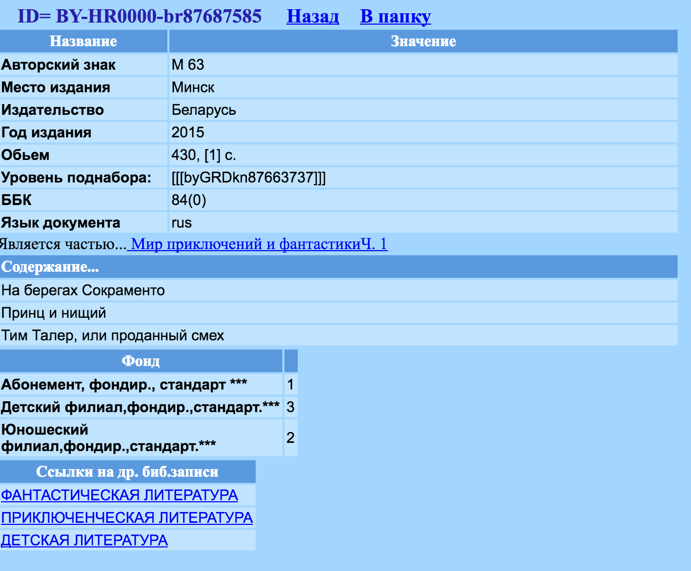

# Books format

## Origins

We use [grodnolib.by](http://grodnolib.by/) as a source of information about books. Hereupon we have quite similar data format.



## Example

This json with book description was fetched with [alis-web-request](https://github.com/grodno-city/alis-web-request)
```json
{
  "belmarcId": "BY-HR0000-br28392",
  "years": [
    2000,
    2001,
    2002,
    2003,
    2004,
    2005,
    2006,
    2007,
    2008,
    2009,
    2010,
    2011
  ],
  "references": [
    {
      "tag": 2,
      "value": "гл. ред. С.Чупринин"
    },
    {
      "tag": 2,
      "value": "учредитель: Труд. коллектив ред. журн."
    }
  ],
  "fields": [
    {
      "tag": "Каталожный номер",
      "value": "84"
    },
    {
      "tag": "Основное заглавие",
      "value": "Знамя"
    },
    {
      "tag": "Сведения,относящиеся к заглавию",
      "value": "ежемес. лит.-худож. и обществ.-полит. журн."
    },
    {
      "tag": "Первые сведения об ответствен.",
      "value": "гл. ред. С.Чупринин"
    },
    {
      "tag": "2-е и послед.свед.об ответстве",
      "value": "учредитель: Труд. коллектив ред. журн."
    },
    {
      "tag": "Первое место издания",
      "value": "М."
    },
    {
      "tag": "Дата издания,распространения",
      "value": "2000"
    },
    {
      "tag": "Примечание",
      "value": "Янв. 1931 г."
    },
    {
      "tag": "ISSN",
      "value": "0130-1616"
    },
    {
      "tag": "Индекс ББК",
      "value": "84"
    }
  ],
  "funds": [],
  "id": 28392
}
```
